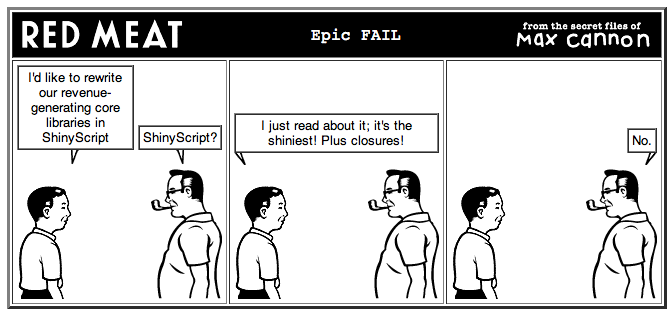
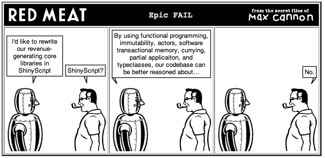
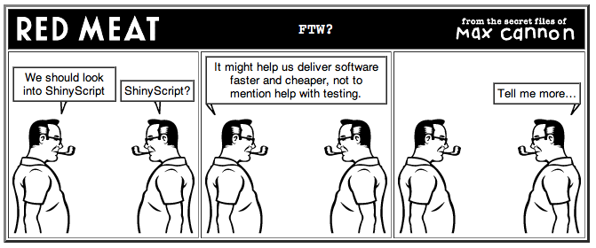

!SLIDE center
# How not to convince your boss

!SLIDE center
# How to anger your boss

!SLIDE center
# Think like a boss

!SLIDE bullets incremental
# Who are bosses?

* Tech Lead
* Architect
* Director
* CTO
* CEO

!SLIDE bullets incremental
# What do they want?
## Software that:
* works properly
* is on time
* is cheap

!SLIDE 
# How do we typically make that happen?

!SLIDE bullets 
# Works Properly
* Requirements
* Testing

!SLIDE bullets
# On Time
* Productivity
* Reasonable Timelines

!SLIDE  bullets
# Cheap
* Productivity
* Smaller Teams

!SLIDE
# Increaing productivity affects Cost and Schedule

!SLIDE
# Increaing *testing* productivity affects "Works Properly"

!SLIDE 
# What *is* productivity, though?

!SLIDE bullets incremental
* <strike>LOC per hour</strike>
* <strike>Story Points per Day</strike>
* <strike>Bugs per week</strike>
* More stuff done per time unit

!SLIDE bullets incremental
# Do the same with less
* LOC
* Hours
* Developers

!SLIDE bullets incremental
# But without:
* Affecting Maintainability
* Introducing Risk

!SLIDE
# Scala is positioned to win on all counts
