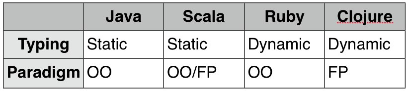
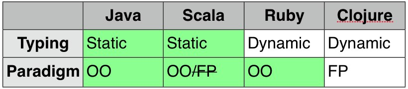

!SLIDE 
# Risk of any new language

!SLIDE
# Scala is the *least* risky, given the potential gains

!SLIDE bullets incremental
# Yeah, right
* Ruby?
* Clojure?

!SLIDE center

!SLIDE center

!SLIDE center
# Scala requires the smallest mental shift from Java

!SLIDE bullets incremental
# Use functional programming on *your* schedule
* Not Oracle's
