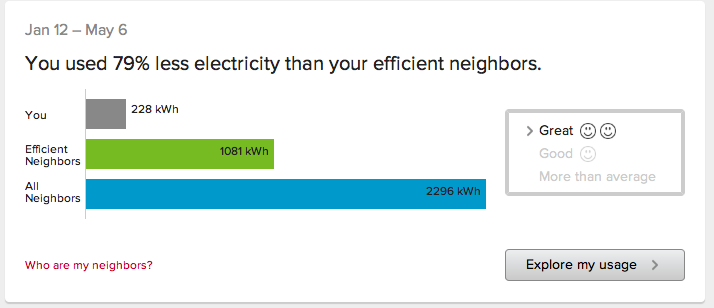

!SLIDE 
# Scala saves you time
## Without sacrificing maintainability or introducing risk

!SLIDE center
# Problem
## Test the neighbor comparison display

!SLIDE bullets
# World's Briefest Architecture Document
* Resource-oriented (<code>/person/:id/neighbor_comparison</code>)
* One Resource, many views
* <code>/person/:id/neighbor_comparison/summary
* <code>/person/:id/neighbor_comparison/detailed

!SLIDE bullets incremental
# Tests
* No unset message properties
* You can't see until you login
* You can't access someone else's comparison
* The JSP page compiles and works
* The values from the back-end show up

!SLIDE smaller
# Solution - JWebUnit
## Helper base class

    @@@ Java
    public class WebTestBase {
      protected String makeUrl(String resource, String view);

      protected void assertElementContains(
          String element, String cssClass, String value);

      protected void checkForMissingMessageProperties();

      protected void assertElementPresent(
          String element, String cssClass);

      protected void assertElementPresentById(
          String element, String id);

      protected void loginAs(String email);

      protected WebTester tester;

      @Before public void setUp() throws Exception {
        this.tester = new WebTester();
      }
    }

!SLIDE smaller
# Test Class

    @@@Java
    public class WebTestNeighborComparision extends WebTestBase {
      @Test
      public void testValuesWhenComparisonExists() throws Exception {
        loginAs("l4@test.com");
        this.tester.goToPage(makeUrl(
            "/person/" + 45 + "/neighbors/comparison",
            "summary");
        checkForMissingMessageProperties();

        assertElementContains("span","type","elec");
        assertElementContains("td","you","45");
        assertElementContains("td","neighbors","1234");
        assertElementContains("td","eff-neighbors","30");
      }

!SLIDE smaller
# JWebUnit (con't)

    @@@ Java
      @Test
      public void testValuesWhenComparisonNotPossible() 
        throws Exception {
        loginAs(this.tester,"l5@test.com");
        this.tester.goToPage(makeUrl(
            "/person/" + 46 + "/neighbors/comparison",
            "summary");
        checkForMissingMessageProperties();

        assertElementPresent("div","noData");
      }

!SLIDE smaller
# JWebUnit (con't)
## Don't forget to test the login requirements

    @@@ Java
      @Test
      public void testLoginRequired() throws Exception {
        this.tester.goToPage(makeUrl(
            "/person/" + 46 + "/neighbors/comparison",
            "summary");
        assertElementPresentById("body","login");
      }

!SLIDE smaller
# JWebUnit (con't)
## Really gnarly
    @@@Java
      @Test
      public void testSecureFromOtherUsers() throws Exception {
        loginAs(this.tester,"l4@test.com");
        try {
          this.tester.goToPage(makeUrl(
              "/person/" + 46 + "/neighbors/comparison",
              "summary");
          fail("Expected a FailingHttpStatusCodeException");
        }
        catch (TestingEngineResponseException e) {
          Throwable t = e.getCause();
          if (t instanceof FailingHttpStatusCodeException) {
              assertEquals(403,
                  ((FailingHttpStatusCodeException)t).getStatusCode());
          }
          else {
              throw e;
          }
        }
      }
    }

!SLIDE bullets incremental
# So what's the problem?
* Hard to read assertions
* Fair amount of boilerplate
* Almost every test needs <code>testLoginRequired</code> and <code>testSecureFromOtherUsers</code> (easy to forget)
* Testing for HTTP status codes sucks

!SLIDE bullets incremental
# How does this affect productivity?
* Takes a lot of effort to get right
* Have to duplicate a LOT of tests when we add a new view
* Can't hide it all with superclasses/helpers
* Tests are first thing to cut when schedules slip

!SLIDE bullets incremental
# Tests that take too long to make don't get created
* Bugs still get found…later
* We still have to fix them
* But it just takes longer

!SLIDE bullets incremental
# Scala can help
## (it helped OPOWER)
* one weekend
* make tests easier to write
* make tests easier to read & maintain
* don't require entire team to learn every Scala feature

!SLIDE smaller

    @@@Scala
    resource("person/{id}/neighbors/comparison",(resource) => {
      resource.requiresLoginAs("l4@test.com")
      resource.withIds(Map("id" -> "10024"))
        .andWithErrors(Map("id" -> "10025") -> 403)

      resource.shouldContain("elec").in("span").withClass("type")
      resource.shouldContain("45").in("td").withClass("you")
      resource.shouldContain("1234").in("td").withClass("neighbors")
      resource.shouldContain("30").in("td").withClass("eff-neighbors")
      resource.hasView("summary")
    })

    resource("person/{id}/neighbors/comparison",(resource) => {
      resource.requiresLoginAs("l5@test.com")
      resource.withIds(Map("id" -> "10025"))

      resource.shouldContainElement("div").withClass("noData")
      resource.hasView("summary")
    })

!SLIDE bullets incremental
# Better?
* assertions more clear
* structure more clear (e.g. <code>hasView</code>)
* little boilerplate
* not *too* alien

!SLIDE bullets incremental
# What about checking message properties?
* baked into framework…impossible to forget to check

!SLIDE bullets incremental
# What about checking for login required?
* baked into framework…impossible to forget to check

!SLIDE smaller
# What if we add a new view?
<pre>
resource("person/{id}/neighbors/comparison",(resource) => {
  resource.requiresLoginAs("l4@test.com")
  resource.withIds(Map("id" -> "10024"))
    .andWithErrors(Map("id" -> "10025") -> 403)

  resource.shouldContain("elec").in("span").withClass("type")
  resource.shouldContain("45").in("td").withClass("you")
  resource.shouldContain("1234").in("td").withClass("neighbors")
  resource.shouldContain("30").in("td").withClass("eff-neighbors")
  resource.hasView("summary")
  <b>resource.hasView("detailed")</b>
  })
</pre>

!SLIDE smaller
# A new view with its own constraints?

<pre>
resource("person/{id}/neighbors/comparison",(resource) => {
  resource.requiresLoginAs("l5@test.com")
  resource.withIds(Map("id" -> "10025"))

  resource.shouldContainElement("div").withClass("noData")
  resource.hasView("summary")
  <b>resource.hasView("detailed", (view) => {
    view.shouldContainLink("View Usage Data")
  })</b>
})
</pre>

!SLIDE bullets incremental
# "Crazy" Scala features required
* Function Literals:  <code>(arg) => { body }</code>
* Collection "Literals": <code>Map(key -> value)</code>
* That's *IT*

!SLIDE bullets incremental
# How does this affect hours?
* Created framework quickly
* Can add/modify tests quickly
* Tests are better with less effort

!SLIDE 
# Coding faster helps the schedule

!SLIDE 
# Testing better *and* faster helps quality

!SLIDE bullets incremental
# Risk? Maintainability?
* Tests are *more* maintainable
* Judicious use of few "new" features mitigates risk
