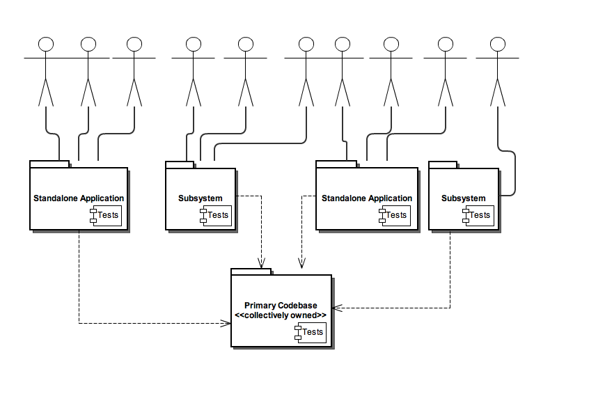

!SLIDE
# Convincing the Boss

!SLIDE bullets incremental
# What we're really asking
* To *use* Scala, not replace Java
* Add a powerful tool to our toolbox
* Keep proven technologies around

!SLIDE bullets incremental
# The boss will want specifics
* In-house expert (that's you)
* Well-chosen pilot project
* Judicious use of Scala features

!SLIDE bullets incremental
# Become the expert
* Prototype something
* weekend/20% time/innovation day

!SLIDE 
# Pilot Project

!SLIDE center
# Basic Team/Code Org Chart

!SLIDE bullets incremental
# "Improve" Primary Codebase
* Haphazard
* Gains at micro level only
* Could affect entire team

!SLIDE bullets incremental
# Testing?
* No effect on production codebase
* Risks of new language more acceptible
* Small, constrained problem set

!SLIDE bullets incremental
# New (or refactored) subsystem?
* Separate from primary codebase
* High reward
* Smaller team, easier ramp up

!SLIDE bullets incremental
# New project/application?
* More risky
* Even higher reward
* Smaller team, easier ramp up

!SLIDE bullets incremental
# Judicious use of Scala features
* Start slowly
* OO design
* Keep to core library
* Avoid implicits and internal DSLs

!SLIDE bullets incremental
# Be sure to use…
* package objects
* 2.8 collections library
* <code>Option</code>
* case classes

